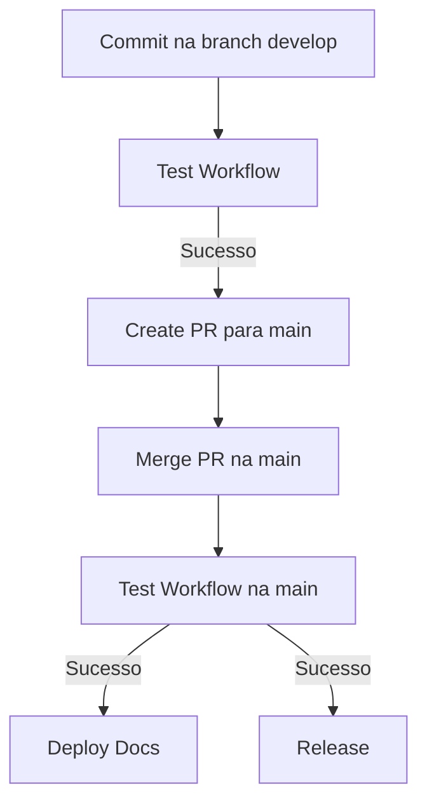

# 📦 GitHub Actions Workflows

Este diretório contém os workflows utilizados para automatizar testes, deploy de documentação e releases via `semantic-release` no repositório.

---

## 📈 Fluxo de CI/CD

### 🔸 Develop → Main (via Pull Request)

1. **Commit na branch `develop`**
   - 📦 Aciona o workflow [`test.yml`](./0.test.yml) para rodar os testes automatizados.
   - 📦 Se os testes passarem, aciona o workflow [`create-pr.yml`](./0.create-pr.yml) que cria uma Pull Request da `develop` para a `main`.

2. **Merge da Pull Request na `main`**
   - 📦 Aciona novamente o workflow [`test.yml`](./0.test.yml) na `main`.
   - 📦 Se os testes passarem:
     - Executa o workflow [`deploy-docs.yml`](./2.deploy-docs.yml) para publicar a documentação.
     - Executa o workflow [`release.yml`](./3.release.yml) para gerar uma nova release usando o `semantic-release`.
     - Executa o workflow [`publish.npm.yml`](./4.publish.npm.yml) para publicar o pacote no `npm`.

---

## 📄 Workflows Disponíveis

| Workflow           | Descrição                                                                                    | Trigger                               |
|:-------------------|:---------------------------------------------------------------------------------------------|:--------------------------------------|
| `0.test.yml`       | Executa testes automatizados no projeto.                                                     | `push` para `develop` e `main`        |
| `1.create-pr.yml`  | Cria uma Pull Request automaticamente da `develop` para a `main` após sucesso nos testes.    | `workflow_run` do `test.yml`          |
| `2.deploy-docs.yml`| Publica a documentação do projeto após merge na `main`.                                      | `workflow_run` do `test.yml` na `main`|
| `3.release.yml`    | Gera automaticamente uma nova release usando `semantic-release` após merge na `main`.        | `workflow_run` do `test.yml` na `main`|
| `4.publish.npm.yml`| Publica o pacote no `npm` apos merge na `main`.                                              | `workflow_run` do `test.yml` na `main`|

---

## 📦 Configuração do `semantic-release`

- Definida via arquivo [`.releaserc.json`](../../.releaserc.json)
- Gera release somente na branch `main`.
- Utiliza convenção de commits para determinar o tipo de versão (`major`, `minor`, `patch`).

---

## 📌 Observações

- A branch `main` está protegida e aceita apenas Pull Requests.
- Todos os workflows de deploy e release são acionados somente após sucesso nos testes.
- O workflow `release.yml` só executa publicação se for executado na `main` com commits válidos para release.

---

## 📝 Referências

- [semantic-release](https://semantic-release.gitbook.io/)
- [GitHub Actions](https://docs.github.com/en/actions)

