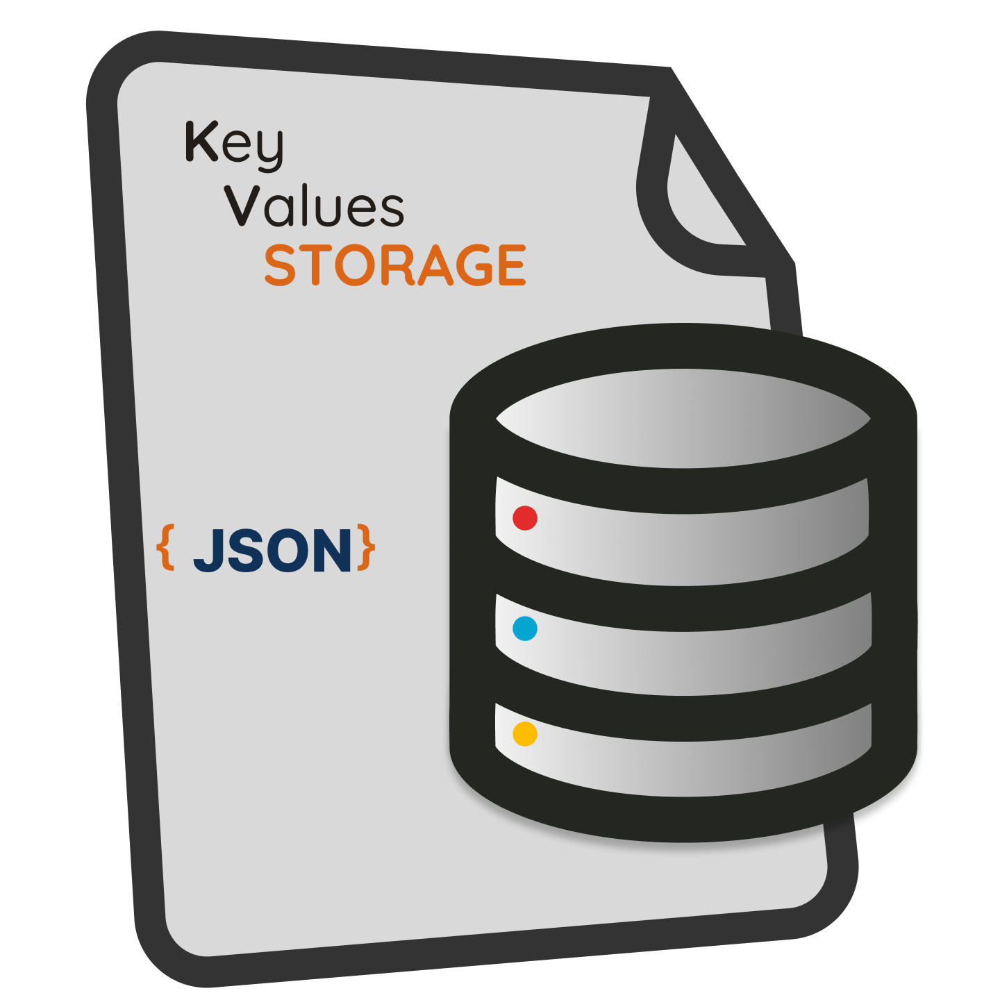

<div id="top" align="center" style="text-align:center;">
<h1>
  
  <br> KeyValues Storage <a href="https://navto.me/heliomarpm" target="_blank"></a>

  [![DeepScan grade][url-deepscan-badge]][url-deepscan]
  [![CodeFactor][url-codefactor-badge]][url-codefactor]
  [![Test][url-test-badge]][url-test]
  [![Coverage][url-coverage-badge]][url-coverage-report]

  [![NPM version][url-npm-badge]][url-npm]
  [![Downloads][url-downloads-badge]][url-downloads]
  
</h1>

<div class="badges">

  [![PayPal][url-paypal-badge]][url-paypal]
  [![Ko-fi][url-kofi-badge]][url-kofi]
  [![Liberapay][url-liberapay-badge]][url-liberapay]
  [![GitHub Sponsors][url-github-sponsors-badge]][url-github-sponsors]
  
</div>
</div>

<!--  -->
<!--  -->
<!--  -->

## 📚 Summary

`KeyValues Storage` is a lightweight, file-based utility for managing key-value pairs using JSON. It offers intuitive methods for reading, writing, checking, and deleting values — all with support for both synchronous and asynchronous operations.

## ❓When Should You Use This Library?

You should consider using KeyValues Storage when you need:

1. ✅ A simple and lightweight key-value store without the overhead of a full database.
2. 🗂️ To persist configuration or state in local .json files.
3. 🚀 Quick read/write operations for small or medium-sized data.
4. 🧩 Nested object support with dot notation access ('user.profile.name').
5. 🧪 Built-in support for both synchronous and asynchronous APIs. 
6. 🛡️ Safe and atomic writes to prevent file corruption.
7. 📦 Minimal dependencies (just lodash and write-file-atomic).

### 💡 It's a great fit for:

- Desktop apps (Electron, Tauri, etc.)
- Low-traffic web servers or services
- Caching user preferences
- Storing app metadata
- Configuration files
- Testing and development tools
- CLI Tools

## 🚀 Main Features

- Manage key-value pairs in a persistent JSON file
- Support for nested key paths
- Multiple instances with different file names
- Sync and async methods
- Atomic writes and optional formatting

## 🔧 Usage

**⚠Install the library:**

```bash
npm install @heliomarpm/kvs
# or 
yarn add @heliomarpm/kvs
```

### ✏️ Example Code

```js
// Default options
{
  atomicSave: true,
  fileName: 'keyvalues.json',
  prettify: false,
  numSpaces: 2
}
```

```typescript
// Create a new instance of KeyValues with or without custom options
const kvs = new KeyValues()
//or 
const kvs = new KeyValues({ fileName: 'config.json',  prettify: true });

const color =
{
  "name": "cerulean",
  "code": {
    "hex": "#003BE6",
    "rgb": [0, 179, 230]
  }
}

// Set a key-value
kvs.setSync(['settings', 'language'], "pt-Br");
kvs.getSync(['settings', 'language'])	
// => 'pt-Br'

// Set/Add a key settings
kvs.setSync("settings.default", "en");
kvs.getSync("settings")
// => { "language": "pt-Br", "default": "en" }

kvs.getSync();	
// => { "settings": { "language": "pt-Br", "default": "en" } }

// replace key settings
kvs.setSync("settings", { theme: "dark"});
kvs.getSync("settings")
// => { "theme": "dark" }

// Added a new key-value
kvs.setSync("color", color);
kvs.getSync();
// => { "theme": "dark", "color": { "name": "cerulean", "code": { "rgb": [0, 179, 230], "hex": "#003BE6" } } }

// Replace all key-values
kvs.setSync(color);
kvs.getSync();
// => { "name": "cerulean", "code": { "rgb": [0, 179, 230], "hex": "#003BE6" } }

// Unset a key-value
kvs.unsetSync();
kvs.getSync();
// => {}

// Set a new key-values
kvs.setSync("color", color);
kvs.getSync();	
// => { "color": { "name": "cerulean", "code": { "rgb": [0, 179, 230], "hex": "#003BE6" } } }

kvs.getSync("color.name")
// => "cerulean"

kvs.getSync("color.code.hex")
// => "#003BE6"

kvs.getSync(["color", "code"])
// or
kvs.getSync("color.code")
// => { "hex": "#003BE6", "rgb": [0, 179, 230] }

kvs.getSync(["color", "hue"])
// => undefined

// Set a key-value pair
await kvs.set("color.name", "sapphire");

// Get the value at a specific key path
const value = await kvs.get("color.name");
// => "sapphire"

// Check if a key path exists
const exists = await kvs.has("color.name");
// => true

// Remove a key-value pair
await kvs.unset("color.name");
await kvs.get(); 
// => { "code": { "rgb": [0, 179, 230], "hex": "#003BE6" } }

const exists = kvs.hasSync("color.name");
// => false

kvs.unset().then(() => {
  console.log("All key-value pairs have been removed.");
});
```

## 📚 API Reference

See the [API documentation](https://heliomarpm.github.io/keyvalues-storage) for a complete list of available functions and their signatures.

### 🧪 Methods

| Method | Description |
|--------|-----------|
 `constructor(options?)` | Initializes a new instance of the `KeyValues` class with optional custom options.
 `file(): string` | Returns the path to the JSON file.
 `reset(): void` | Resets the configuration of the `KeyValues` instance to default options.
 `has(keyPath): Promise<boolean>` | Checks if a key path exists asynchronously.
 `hasSync(keyPath): boolean` | Checks if a key path exists synchronously.
 `get<T>(keyPath?): Promise<T>` | Gets the value at a specific key path asynchronously.
 `getSync<T>(keyPath?): T` | Gets the value at a specific key path synchronously.
 `set<T>(...args): Promise<void>` | Sets a value at a specific key path asynchronously.
 `setSync<T>(...args): void` | Sets a value at a specific key path synchronously.
 `unset(keyPath?): Promise<void>` | Removes a key-value pair at a specific key path asynchronously.
 `unsetSync(keyPath?): void` |Removes a key-value pair at a specific key path synchronously.


## 📦 Project Scripts

* `npm run check` — runs formatter, linter and import sorting to the requested files
* `npm run format` — run the formatter on a set of files
* `npm run lint` — run various checks on a set of files
* `npm run test` — run unit tests
* `npm run test:c` — run unit tests with coverage
* `npm run commit` - run conventional commits check
* `npm run release:test` — dry run semantic release 
* `npm run build` — build library


## 📦 Dependencies

- [](https://lodash.com) Utility functions for working with objects and arrays. 
- [](https://github.com/npm/write-file-atomic) Ensures file writes are safe and atomic.


## 🤝 Contributing

We welcome contributions! Please read:

- [Code of Conduct](docs/CODE_OF_CONDUCT.md)
- [Contributing Guide](docs/CONTRIBUTING.md)

Thank you to everyone who has already contributed to the project!

<a href="https://github.com/heliomarpm/keyvalues-storage/graphs/contributors" target="_blank">
  
</a>

###### Made with [contrib.rocks](https://contrib.rocks).


### ❤️ Support this project

If this project helped you in any way, there are several ways to contribute. \
Help us maintain and improve this template:

⭐ Starring the repository \
🐞 Reporting bugs \
💡 Suggest features \
🧾 Improving the documentation \
📢 Share with others

💵 Supporting via GitHub Sponsors, Ko-fi, Paypal or Liberapay, you decide. 😉

<div class="badges">

  [![PayPal][url-paypal-badge]][url-paypal]
  [![Ko-fi][url-kofi-badge]][url-kofi]
  [![Liberapay][url-liberapay-badge]][url-liberapay]
  [![GitHub Sponsors][url-github-sponsors-badge]][url-github-sponsors]

</div>


## 📝 License

[MIT © Heliomar P. Marques](LICENSE)  <a href="#top">🔝</a>

----
<!-- Sponsor badges -->
[url-paypal-badge]: https://img.shields.io/badge/donate%20on-paypal-1C1E26?style=for-the-badge&labelColor=1C1E26&color=0475fe
[url-paypal]: https://bit.ly/paypal-sponsor-heliomarpm
[url-kofi-badge]: https://img.shields.io/badge/kofi-1C1E26?style=for-the-badge&labelColor=1C1E26&color=ff5f5f
[url-kofi]: https://ko-fi.com/heliomarpm
[url-liberapay-badge]: https://img.shields.io/badge/liberapay-1C1E26?style=for-the-badge&labelColor=1C1E26&color=f6c915
[url-liberapay]: https://liberapay.com/heliomarpm
[url-github-sponsors-badge]: https://img.shields.io/badge/GitHub%20-Sponsor-1C1E26?style=for-the-badge&labelColor=1C1E26&color=db61a2
[url-github-sponsors]: https://github.com/sponsors/heliomarpm

<!-- GitHub Actions badges -->
[url-codeql-badge]: https://github.com/heliomarpm/keyvalues-storage/actions/workflows/codeql.yml/badge.svg 
[url-codeql]: https://github.com/heliomarpm/keyvalues-storage/security/code-scanning
[url-test-badge]: https://github.com/heliomarpm/keyvalues-storage/actions/workflows/0.test.yml/badge.svg
[url-test]: https://github.com/heliomarpm/keyvalues-storage/actions/workflows/0.test.yml
[url-coverage-badge2]: https://img.shields.io/badge/coverage-dynamic.svg?label=coverage&color=informational&style=flat&logo=jest&query=$.coverage&url=https://heliomarpm.github.io/keyvalues-storage/coverage-badge.json
[url-coverage-badge]: https://img.shields.io/endpoint?url=https://heliomarpm.github.io/keyvalues-storage/coverage/coverage-badge.json
[url-coverage-report]: https://heliomarpm.github.io/keyvalues-storage/coverage
<!-- https://img.shields.io/endpoint?url=https://heliomarpm.github.io/keyvalues-storage/coverage-badge.json&label=coverage&suffix=%25 -->
[url-release-badge]: https://github.com/heliomarpm/keyvalues-storage/actions/workflows/3.release.yml/badge.svg
[url-release]: https://github.com/heliomarpm/keyvalues-storage/actions/workflows/3.release.yml
[url-publish-badge]: https://github.com/heliomarpm/keyvalues-storage/actions/workflows/4.publish-npm.yml/badge.svg 
[url-publish]: https://github.com/heliomarpm/keyvalues-storage/actions/workflows/4.publish-npm.yml

<!-- other badges -->
[url-npm-badge]: https://img.shields.io/npm/v/@heliomarpm/kvs.svg
[url-npm]: https://www.npmjs.com/package/@heliomarpm/kvs
[url-downloads-badge]: https://img.shields.io/npm/dm/@heliomarpm/kvs.svg
[url-downloads]: http://badge.fury.io/js/@heliomarpm/kvs.svg
[url-deepscan-badge]: https://deepscan.io/api/teams/19612/projects/25344/branches/791226/badge/grade.svg
[url-deepscan]: https://deepscan.io/dashboard#view=project&tid=19612&pid=25344&bid=791226
[url-codefactor-badge]: https://www.codefactor.io/repository/github/heliomarpm/keyvalues-storage/badge
[url-codefactor]: https://www.codefactor.io/repository/github/heliomarpm/keyvalues-storage
